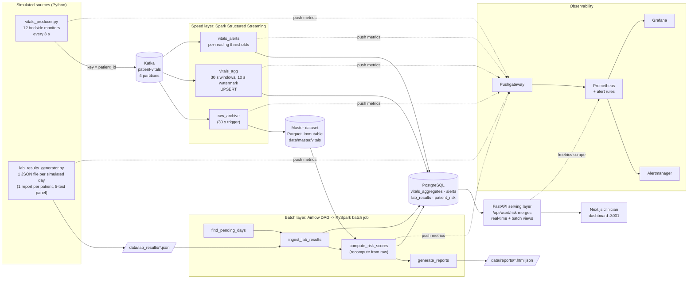

# Hospital Patient Vital Signs Monitoring Pipeline

An end-to-end **Lambda architecture** data pipeline for near-real-time patient
vitals monitoring, built for the EC8203 Applied Big Data Engineering
mini-project (**Use Case 2**).

> **Business question:** Which patients show concerning vital-sign trends
> right now, and how do yesterday's lab results change the risk picture for
> those patients going forward?

The single endpoint that answers it is **`GET /api/ward/risk`** (real-time
view + batch view merged per patient); the daily consolidated report is
`GET /api/reports/latest` plus the HTML/JSON files in `data/reports/`.

## Architecture



| Layer | Technology | What it does here |
|---|---|---|
| Ingestion | Apache Kafka | Durable, replayable log; keyed by `patient_id` so each patient's readings stay ordered in one partition |
| Speed layer | Spark Structured Streaming | Raw archive to the master dataset; 30 s windowed aggregates (upsert); threshold alerts with `event_id` tracing |
| Master dataset | Parquet (partitioned by `event_date`) | Immutable raw vitals; the batch layer recomputes from it |
| Batch layer | Airflow + PySpark batch | Per simulated day: ingest the lab file (one report per patient with 5 tests), recompute vitals features + HR/SpO2 trend from raw data, join with labs, score risk |
| Serving store | PostgreSQL 15 (Docker) | Queryable real-time and batch views |
| Serving | FastAPI | REST API; `/api/ward/risk` merges both views (early warning score + trend + lab-driven risk) |
| Frontend | Next.js | Plain-language dashboard for clinicians |
| Observability | structlog, Prometheus, Pushgateway, Grafana, Alertmanager | JSON logs, metrics, 8 alert rules, dashboard |

### Simulated time

**1 simulated day = 300 s (5 minutes)** (`SIMULATED_DAY_SECONDS`).

- Vitals are emitted every 3 s with real (UTC) timestamps; they are not compressed.
- The lab generator writes one end-of-day file every 300 s. Day *N*'s
  `collected_at` closes the day, so the batch layer analyses the 300 s of raw
  vitals ending at that timestamp.
- The Airflow DAG runs every 150 s and processes every lab file that has no
  risk report yet (so it catches up after downtime).
- A 10-minute demo covers two full simulated days.

## Prerequisites

- Docker Desktop (Kafka, Postgres, Airflow, monitoring stack)
- Python 3.11+ and Java 17 or 21 (for the Spark speed layer on the host)
- Node.js 20+ (frontend, optional; it also runs in Docker)
- **Windows only:** `HADOOP_HOME` pointing at a folder whose `bin\` holds
  `winutils.exe` + `hadoop.dll` (Hadoop 3.3.x), and `JAVA_HOME` set to the JDK
  root (not `...\bin`). Spark needs these even for local files.

## Setup & running

```bash
# 1. Python deps + config
python -m venv .venv
.venv/Scripts/activate            # Linux/macOS: source .venv/bin/activate
pip install -r requirements.txt
cp .env.example .env

# 2. Infrastructure: Kafka, Postgres (schema auto-applied), Airflow, monitoring
docker compose up -d
docker compose ps                 # wait until kafka / postgres are healthy

# 3. Kafka topic
python -m ingestion.kafka_config
```

Then start each component in its own terminal:

```bash
python -m data_sources.vitals_producer                   # streaming source
python -m processing.speed_layer.vitals_stream_processor # speed layer (Spark)
python -m serving.api                                    # API on :8000
python -m data_sources.lab_results_generator             # batch source (first file after 300 s)
```

- Airflow UI: http://localhost:8081 (admin / admin). Unpause
  `daily_patient_risk_pipeline`; it picks up each new lab file automatically.
- Frontend: `cd frontend && npm install && cp .env.local.example .env.local && npm run dev`
  then open http://localhost:3001 (or `docker compose up -d frontend`).

**Shortcut for demos:** `python -m data_sources.lab_results_generator --once`
writes the next day's file immediately instead of waiting 300 s.

**Replaying a day** (the Lambda recompute path), e.g. after changing the risk model:

```bash
docker exec airflow python -m processing.batch_layer.daily_risk_processor --day 3
```

**Resetting the demo:** `docker compose down -v` (drops DB volumes), then delete `data/` and `checkpoints/`.

### Tests

```bash
python -m pytest -q
```

42 unit tests cover the data sources (schema, spike rate, one full-panel lab report per patient, atomic writes,
restart/resume), the clinical scoring rules (NEWS2 bands, risk model, trend
penalties) and the batch layer's join + scoring step.

## API endpoints

| Method | Endpoint | Description |
|---|---|---|
| GET | `/api/ward/risk` | **Merged view**: per patient early warning score, 5-min HR/SpO2 trend, latest lab-driven risk, change vs previous day, outlook |
| GET | `/api/ward/status` | Latest 30 s window per patient (speed-layer view) |
| GET | `/api/patients/{id}/vitals` | Recent windows for one patient |
| GET | `/api/patients/{id}/labs` | Recent lab results for one patient |
| GET | `/api/patients/{id}/risk` | Risk history by simulated day + latest risk factors |
| GET | `/api/alerts/active` | Unacknowledged alerts (each carries the source reading's `event_id`) |
| POST | `/api/alerts/{id}/acknowledge` | Acknowledge an alert |
| GET | `/api/reports/latest` | Latest simulated day's consolidated risk report |
| GET | `/api/reports/day/{n}` | Report for simulated day *n* |
| GET | `/api/reports/days` | Days that have a report |
| GET | `/api/reports/day/{n}/download?format=csv\|html\|json` | **Download** a day's consolidated report |
| GET | `/api/ward/risk-history?days=10` | Risk per patient per day + ward summary (improving / worsening / stable) |
| GET | `/api/health` | App-level health check (JSON) |
| GET | `/metrics` | Prometheus scrape endpoint |

Interactive docs: http://localhost:8000/docs

## How the risk is calculated

All rules live in `processing/clinical_rules.py` (pure Python, unit-tested).

**Daily risk (batch layer, once per simulated day, per patient)**

1. **Vital-signs score (0-100)**: percentage of the day's raw readings that
   crossed a clinical alarm limit (HR >120 or <50, SpO2 <90, systolic BP >180
   or <80, temperature >38.5 or <35), **+15** if heart rate rose faster than
   1.5 bpm/min over the day, **+15** if SpO2 fell faster than 0.3 %/min.
2. **Lab score (0-100)**: from the patient's daily report (all 5 tests).
   All in range = 0. The most abnormal test sets the score: just outside its
   range ~50, a full range-width outside = 100. **+10** per additional abnormal
   test, capped at 100.
3. **Combined = 0.6 x vitals + 0.4 x lab.** LOW <25, MODERATE 25-50,
   HIGH 50-75, CRITICAL >=75. *Improving / worsening* = change of 5+ points
   versus the previous simulated day.

*Worked example:* 17 % of readings breached limits and HR was rising → vitals =
17 + 15 = 32. Glucose 144 (range 70-100, 1.5 range-widths above) → 100, plus
one more abnormal test (+10) → lab = 100 (capped). Combined = 0.6 x 32 + 0.4 x 100
= 59.2 → **HIGH**.

**Right now (speed layer + serving, every few seconds)**: simplified NEWS2
early-warning score on the latest 30 s window, plus the 5-minute HR/SpO2 slope.
A patient's current *outlook* is the worse of the live picture and the latest
daily risk (`GET /api/ward/risk`).

## Simulated patients and alarm management

- **Patients** follow a state machine: *stable* (vitals mean-revert around
  each patient's own baseline) → occasionally *deteriorating* (HR climbs,
  SpO2/BP fall, temperature rises over 3-5 min) → *recovering* → *stable*.
  Only ~1 % of readings are transient single-reading spikes (motion/probe
  artefacts). This gives real trends to detect, not random noise.
- **Alerts** (speed layer): one open alert per patient + vital. Repeat
  breaches within 5 minutes increase `occurrences` on that alert instead of
  inserting new rows. A single breaching reading is a **WARNING**; it becomes
  **CRITICAL** only when confirmed (breach repeated at a critical level, or
  3+ breaches). A one-off artefact therefore never pages anyone as critical,
  while a deteriorating patient escalates within ~10 seconds.

## Dashboard pages (http://localhost:3001)

| Page | Answers |
|---|---|
| Ward Overview | Live vitals for every patient |
| **Trends** | *Is each patient getting better or worse?* Patients needing attention now (live early-warning score + trend + lab risk), ward risk per simulated day (stacked bars + average line), and a patient x day risk heatmap with an improving / worsening / stable indicator |
| Alerts | De-duplicated alerts with repeat counts; acknowledge |
| Daily Report | Any simulated day's consolidated report, change vs previous day per patient, **download as CSV / HTML / JSON** |
| Patient detail | Vitals trend charts; combined / vitals / lab risk history across days |

## Observability

- **Structured logging**: every component logs JSON through `structlog`
  (`component`, `level`, `timestamp`, plus event fields).
- **Tracing**: each reading has an `event_id`. The producer logs it for
  abnormal readings, the speed layer logs it on `vital_alert_raised` and stores it
  on the alert row, and it stays in the master dataset. The batch layer binds a
  `batch_run_id` + `simulated_day` to every log line of a run.
- **Metrics**: FastAPI is scraped at `/metrics` (gauges recomputed from Postgres).
  The producer, lab generator, speed layer and batch layer push counters and a
  heartbeat to the Pushgateway, since they are not HTTP servers.
- **Alert rules** (`observability/prometheus/alert_rules.yml`): VitalsIngestionStale,
  LabGeneratorStale, SpeedLayerStale, BatchLayerStale, NoRecentVitalsData,
  HighVitalsSendErrorRate, ActiveCriticalPatientAlerts, PipelineComponentUnreachable.
- **Grafana** http://localhost:3000 (admin / admin): ward snapshot, ingestion
  and error rates, heartbeat age per component, speed/batch throughput, risk
  distribution, Kafka topic throughput.
- Prometheus :9090 · Alertmanager :9093 · Pushgateway :9091

## Project structure

```
├── docker-compose.yml          # Kafka, Postgres, Airflow, monitoring, frontend
├── .env.example                # all configuration (copy to .env)
├── data_sources/               # simulated streaming + daily batch sources
├── ingestion/kafka_config.py   # topic creation
├── processing/
│   ├── clinical_rules.py       # shared thresholds, NEWS2, risk model (pure Python)
│   ├── speed_layer/vitals_stream_processor.py   # Spark Structured Streaming
│   └── batch_layer/daily_risk_processor.py      # PySpark batch job
├── orchestration/              # Airflow DAG + image (Java + PySpark)
├── storage/                    # schema (init.sql) + connection pool
├── serving/                    # FastAPI + report generator
├── observability/              # logging, metrics, Prometheus/Grafana/Alertmanager config
├── frontend/                   # Next.js dashboard
└── tests/                      # pytest suite
```

## Assumptions, simplifications and limitations

- 12 simulated patients; the risk model and simplified NEWS2 (no respiration
  rate / consciousness) are illustrative, not clinically validated.
- Single Kafka broker, replication factor 1; Spark in local mode; Airflow
  `SequentialExecutor` via `airflow standalone`.
- The raw archive is at-least-once (a replayed micro-batch can append twice);
  the batch layer de-duplicates on `event_id`.
- Alarm management is deliberately simple: one open alert per patient+vital,
  repeats within 5 min update it, and it escalates to CRITICAL only when the
  breach is confirmed (repeated at a critical level, or 3+ times).
- Metrics from non-HTTP components go through a Pushgateway, so staleness is
  detected with heartbeat timestamps rather than scrape absence.
- Alertmanager has no notification receiver configured (UI only).
- The frontend is pinned to Next.js 14.2.x; the remaining `npm audit`
  advisories are in features this app does not use (Server Actions,
  Middleware, Image Optimization) and it only runs on localhost.

## Team

Keshara Gunathilaka · Nimendra Gunawardana · Siyathma Wedamulla
